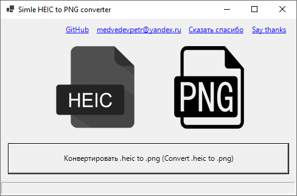
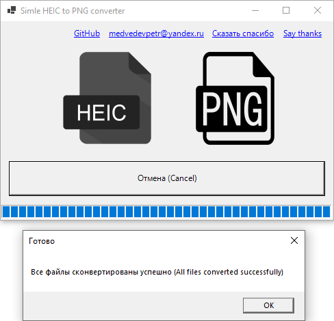

Simple .heic to .png converter
===
**English version in the bottom of the page!**

Простой многопоточный (шустрый) конвертер изображений .heic в .png

Использует библиотеку Magick.NET под капотом.
Для запуска необходим .NET 6.0 Desktop Runtime (v6.0.1)

Приложение готовое для использования в архиве **Download/SimpleHeicToPngConverter.zip**

On English:
---

Simple multithreaded (fast) .heic to .png images converter

Uses Magick.NET library inside.
Requires .NET 6.0 Desktop Runtime (v6.0.1) to run.

Ready to use app is in archive **Download/SimpleHeicToPngConverter.zip**

